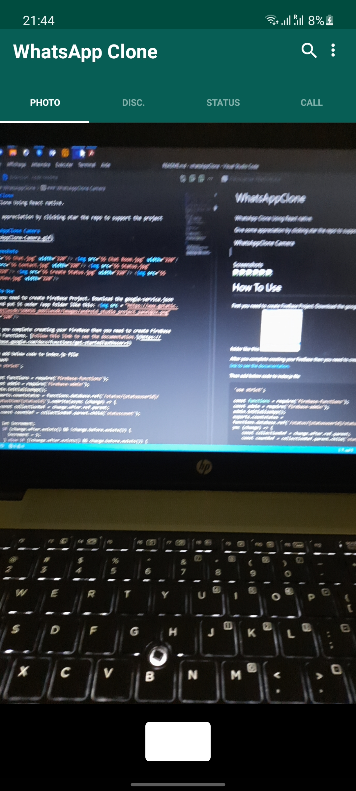

# WhatsApp clone
WhatsApp clone using react native.

This repository is a reproduction of the whatsapp design.
You can clone it, test it to see the result, get inspiration from it or pull on if needed, but you are not allowed to use it in real life for your real projects.

If you like this reproduction, please click on project star to encourage me.
#
### WhatsApp clone Screens


### Screenshots
    

## Installation

Clone the repo locally:

```sh
git clone https://github.com/madiou84/whatsapp-clone.git whatsapp-clone
cd whatsapp-clone
```

Install JavaScript dependencies:

```sh
yarn install
```
OR
```sh
npm install
```

# Run on mobile

For android

```sh
mpx react-native run-android
```
For ios run

```sh
mpx react-native run-ios
```

If you have any problem I recommend that you refer to the react native documentation.